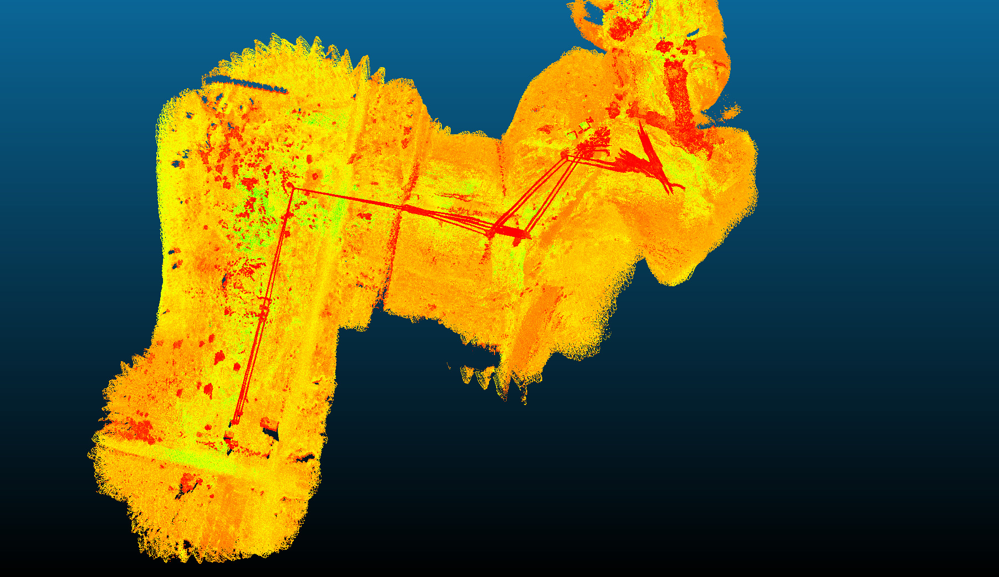
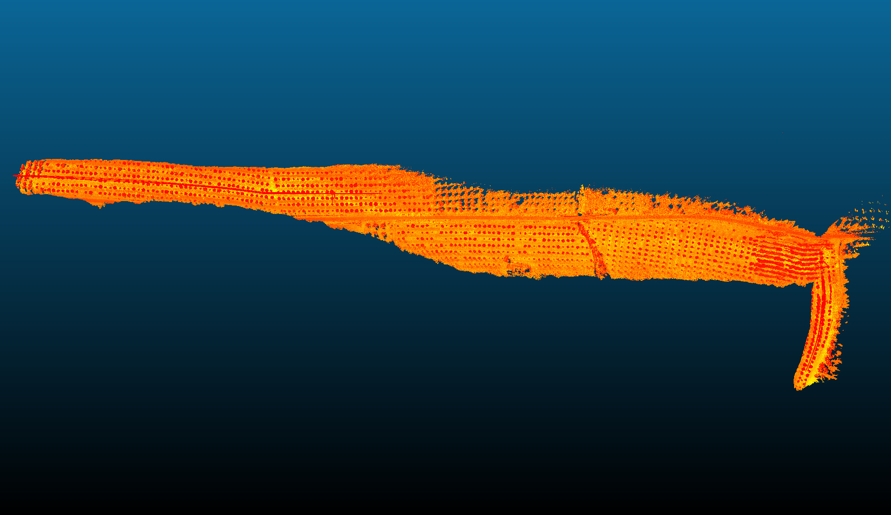

# Leveraging Probabilistic Meshes for Robust LiDAR Mapping
This repository contains the and experimental flight datasets and C++ implementations of our paper:

Paneque, J., Martinez-de-Dios, J. R., & Ollero, A. (2025). **Leveraging Probabilistic Meshes for Robust LiDAR Mapping**. IEEE Transactions on Robotics.

## Citing 
If you use this dataset or code in an academic context, please cite the following publication:

Paneque, J., Martinez-de-Dios, J. R., & Ollero, A. (2025). **Leveraging Probabilistic Meshes for Robust LiDAR Mapping**. IEEE Transactions on Robotics.

```
@article{paneque2025meshes,
  author={Paneque, Julio and Martinez-de-Dios, Jose Ramiro and Ollero, Anibal},
  journal={IEEE Transactions on Robotics}, 
  title={Leveraging Probabilistic Meshes for Robust LiDAR Mapping}, 
  year={2025}
  }
```

## License 
MIT License. Copyright (C) 2025 Julio Paneque, Jose Ramiro Martínez de Dios and Anibal Ollero (GRVC Robotics Lab, Universidad de Sevilla).

This is research code, expect that it changes often and any fitness for a particular purpose is disclaimed.

This work has dependencies on other libraries which are individually mentioned when appearing.

## Dataset
We provide a dataset containing the LiDAR, GPS, and IMU data of the experimental flights in our paper (2 for each scenario, for 3 different scenarios). Each .zip file contains a ROSbag of an experiment, as well as a txt file with the transformation between the GPS and the LiDAR sensor. For convenience, the rosbags are cut in the beginning and end of the flights, where the robot is performing takeoff and landing, since the LiDAR is inclined towards the ground.

The dataset, with more additional notes, is available at [https://zenodo.org/records/14751652](https://zenodo.org/uploads/14751652)

## Code

Instead of providing a unique mapping solution, in this article we propose a series of methods for the initialization and processing of probabilistic meshes, which can be integrated as building blocks within existing mapping schemes. All proposed methods make use of the on-manifold formulation of planar objects, avoiding estimation inconsistencies and also reducing the required memory space for the covariance matrices. In this repository we provide the code for:

- Initializing a probabilistic plane with associated on-manifold uncertainty from a set of points (`plane_estimation`). 
- Considering on-manifold map uncertainty in the point-to-plane distance for robot motion estimation (`plane_measurement_contribution`).
- Estimating the similarity between two adjacent probabilistic plane clusters (`similarity_computation`).
- Merging the probabilistic representations of two plane clusters, using a plane-to-plane merging approach (`plane_to_plane_merging`) and a complementary point-to-plane merging approach (`point_to_plane_merging`).
- Obtaining a probabilistic plane quadric from an on-manifold plane representation (`plane_quadric`). We also provide the raw MonteCarlo estimation values that were used to obtain the polynomials to approximate the probabilistic quadric, which are available in the folder [code/montecarlo_estimation](code/motecarlo_estimation).

*Note: In this repository we generate dummy testing data just to provide an example for each of the different methods. This is not the same as the different Monte-Carlo validations that we explain in-depth in the article. Please refer to it for these validations, and also for detailed mathematical derivations and explanations of each of the different methods.*

### Requirements

The code is written in C++ 17 and was tested in Ubuntu 20.04 using Eigen 3.3.7, g++ 9.4.0, and cmake 3.10. Compatibility with other versions should be possible but is not tested.

### Building and running the code

To build the code, simply run:

```bash
cd code && mkdir build && cd build
cmake .. && make
```

To run any of the methods, just call its example in the resulting build folder like this:
```bash
./plane_estimation
```

## Visual comparison with other methods

Due to space constraints, we could not add more pictures in the article with visual comparisons of the different methods in the scenarios of Figure 10, in the "ALCALA-F1" and "ATLAS-F1" datasets (we have focused on these scenarios since they have not been used before in the state of the art and thus it is interesting to provide visual examples of different methods in them). To complement the article, we provide here a set of images from each studied method in those scenarios.

It should be noted that the compared methods provide different output map densities, and in general are focused on state estimation and not on providing "nice" visual results. This is mainly the case for point and voxel-based methods. To better show all results in a fairer way, we have used the estimated robot trajectory from each method, together with the original scans, to reconstruct a global pointcloud for each scenario, with a downsample filter of 5 cm (to better show the differences between methods) and colored it based on LiDAR intensity. For all the methods that provide meshes as an output instead of a pointcloud, we have colorized the meshes in white, and computed per-vertex normals to give better visuals to the mesh results.

*Note: If a method stops mapping after detecting a failure in state estimation, we only show the fraction of the flight that was mapped succesfully. Please refer to the article for more in-depth numerical comparisons.*

<div align="center">
<details><summary>ALCALA-F1 Scenario</summary>

Method            |   Global picture           |  Close-up
:-------------------------:|:-------------------------:|:-------------------------:
FAST-LIO2  |     |  
Voxel-map  |    |  
PUMA       |             |  
KISS-ICP   |         |  
CT-ICP     |             |  
PIN-LO     |            |  
SLAMesh    |       |  
Ours       |             |  

</details>
</div>

&nbsp;

<div align="center">
<details><summary>ATLAS-F1 Scenario</summary>

Method            |   Global picture           |  Close-up  
:-------------------------:|:-------------------------:|:-------------------------:
FAST-LIO2  |     |   
Voxel-map  |    |   
PUMA       |  *PUMA did not provide visually logic results in this scenario* |
KISS-ICP   |         |   
CT-ICP     |             |   
PIN-LO     |            |   
SLAMesh    |       |   
Ours       |             |   

</details>
</div>
 

## Acknowledgments

Into the making of the code, we would like to mainly thank the authors of [FAST-LIO and FAST-LIO2](https://github.com/hku-mars/FAST_LIO), [IKFoM (Iterated Kalman Filters on Manifolds)](https://github.com/hku-mars/IKFoM), [Fast and Robust QEF Minimization using Probabilistic Quadrics](https://github.com/Philip-Trettner/probabilistic-quadrics), and [Anderson Acceleration for on-Manifold Iterated
Error State Kalman Filters](https://github.com/gaoxiang12/faster-lio), in no particular order. Their mathematical formulations and code have provided a strong basis for the results of this work.

Into the making of the LR-M platform and the experimental flight dataset, we would like to thank Jose Manuel Carmona, Víctor Valseca, Javier Luna, and Ivan Gutiérrez for their collaboration.